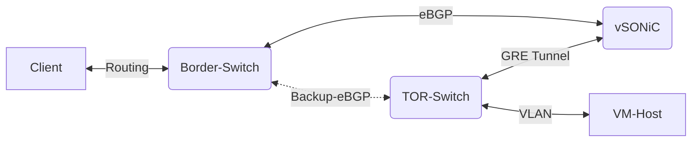

# Azure Stack WAN Simulator Project
> This repo is current private only, and will open to public once fully reviewed.

## Project Overview

To better support different Azure Stack profile service, an automated customized traffic control validation meachinsim need to be developed and deployed to suit rapid growth product request. 

### Main Components
#### SONiC
- [Images](https://github.com/sonic-net/sonic-buildimage)
- [USER MANUAL](https://github.com/sonic-net/SONiC/blob/master/doc/SONiC-User-Manual.md)
- [Sonic VHDX Download](https://aka.ms/azssonic)

#### Network Emulator
[Using NetEm to Emulate Networks](https://srtlab.github.io/srt-cookbook/how-to-articles/using-netem-to-emulate-networks.html#:~:text=NetEm%28Network%20Emulator%29%20is%20an%20enhancement%20of%20the%20Linux,Differentiated%20Services%20%28diffserv%29%20facilities%20in%20the%20Linux%20kernel)

#### Standard DataFlow

In standard deployment, it is hard to automate the traffic control rules in the data path.


#### Customized DataFlow with WAN-SIM Setup

Add vSONiC vm to redirect routes and apply traffic control rules on tunnels to suit needs.
- Border-Switch establishes eBGP neighbors with vSONiC and TOR-Switch.
- Border-Switch advertise default route to TOR-Switch.
- vSONiC establish GRE Tunnel with TOR-Switch.
- vSONiC config static route with longer prefix and forward to GRE Tunnel
- vSONiC redistribute static routes to Border-Switch via eBGP
- TOR-Switch forward all traffic to GRE Tunnel as primary route.
- TOR-Switch advertise Tenant networks to Border-Switch.
- TOR-Switch only learn default route from Border-Switch as backup route.
- Border-Switch learns better Tenant networks from vSONiC because longer prefix.

So the dataflow will show as below:


### IP Assignment
#### WAN-SIM
| Name  | Example | Comments |
|-------|-----|--------|
| GRE Tunnel1 - SIP  | 100.66.76.31  | WAN-SIM Loopback1 IP address, need advertise to LAN |
| GRE Tunnel1 - DIP | 100.71.85.123  | TOR1 BMC_Mgmt_125 IP |
| GRE Tunnel1 - IP | 192.168.10.1/30  | Private per session, can be reused   |

```bash
sudo ip tunnel add gre1 mode gre remote 100.71.85.123 local 100.66.76.31 ttl 255
sudo ip addr add 192.168.10.1/30 dev gre1
sudo ip link set gre1 up
# sudo ip link set gre1 mtu 9100
# sudo ip link set gre1 txqueuelen 10000
# sudo ip tunnel del gre1
```

| Name  | Example | Comments |
|-------|-----|--------|
| GRE Tunnel2 - SIP  | 100.66.76.31  | WAN-SIM Loopback1 IP address, need advertise to LAN |
| GRE Tunnel2 - DIP | 100.71.85.124  | TOR2 BMC_Mgmt_125 IP |
| GRE Tunnel2 - IP | 192.168.10.5/30  | Private per session, can be reused   |

```bash
sudo ip tunnel add gre2 mode gre remote 100.71.85.124 local 100.66.76.31 ttl 255
sudo ip addr add 192.168.10.5/30 dev gre2
sudo ip link set gre2 up
# sudo ip link set gre2 mtu 9100
# sudo ip link set gre2 txqueuelen 10000
# sudo ip tunnel del gre2
```

#### TOR1
| Name  | Example | Comments |
|-------|-----|--------|
| GRE Tunnel - SIP  | 100.71.85.123  | TOR BMC_Mgmt_125 VIP (Has to be IP not Vlan125) |
| GRE Tunnel - DIP | 100.66.76.31  | WAN-SIM Loopback1 IP address |
| GRE Tunnel - IP | 192.168.10.2/30  | Private per session, can be reused.   |

```config
interface Tunnel1
  ip address 192.168.10.2/30
  tunnel source 100.71.85.123
  tunnel destination 100.66.76.31
  mtu 9100
  bandwidth 10000000
  no shutdown
```

#### TOR2
| Name  | Example | Comments |
|-------|-----|--------|
| GRE Tunnel - SIP  | 100.71.85.124  | TOR BMC_Mgmt_125 VIP (Has to be IP not Vlan125) |
| GRE Tunnel - DIP | 100.66.76.31  | WAN-SIM Loopback1 IP address |
| GRE Tunnel - IP | 192.168.10.6/30  | Private per session, can be reused.   |

```config
interface Tunnel1
  ip address 192.168.10.6/30
  tunnel source 100.71.85.124
  tunnel destination 100.66.76.31
  mtu 9100
  bandwidth 10000000
  no shutdown
```

### Routes
#### Prefix-List
```
ip prefix-list DefaultRoute seq 10 permit 0.0.0.0/0
ip prefix-list DefaultRoute seq 50 deny 0.0.0.0/0 le 32
ip prefix-list ExternalPrefix seq 15 permit 0.0.0.0/0
ip prefix-list ExternalPrefix seq 20 deny 0.0.0.0/0 le 32
```

#### Default Route
```
# TOR1
ip route 0.0.0.0/0 Tunnel1 track 1
ip route 100.66.76.31/32 100.71.85.1
ip route 100.66.76.31/32 100.71.85.9
```

```
# TOR2
ip route 0.0.0.0/0 Tunnel1 track 1
ip route 100.66.76.31/32 100.71.85.5
ip route 100.66.76.31/32 100.71.85.13
```
#### BGP
```
router bgp 65242
  router-id 100.71.85.21
  bestpath as-path multipath-relax
  log-neighbor-changes
  address-family ipv4 unicast
    network 100.69.176.0/24
    network 100.69.177.0/24
    network 100.69.178.0/25
    network 100.69.178.128/25
    network 100.69.179.0/28
    network 100.69.179.16/28
    network 100.69.179.32/28
    network 100.69.179.48/28
    network 100.69.179.64/28
    network 100.69.179.80/28
    network 100.69.179.96/28
    network 100.69.179.112/28
    network 100.69.179.128/28
    network 100.69.179.144/28
    network 100.69.179.160/28
    network 100.69.179.176/28
    network 100.69.179.192/28
    network 100.69.179.208/28
    network 100.69.179.224/28
    network 100.69.179.240/28
    network 100.71.85.0/30
    network 100.71.85.8/30
    network 100.71.85.16/30
    network 100.71.85.21/32
    network 100.71.85.64/26
    network 100.71.131.0/25
    maximum-paths 8
    maximum-paths ibgp 8
  neighbor 100.71.85.1
    remote-as 64846
    description TO_Border1
    address-family ipv4 unicast
      prefix-list ExternalPrefix in
      maximum-prefix 12000 warning-only
  neighbor 100.71.85.9
    remote-as 64846
    description TO_Border2
    address-family ipv4 unicast
      prefix-list ExternalPrefix in
      maximum-prefix 12000 warning-only
  neighbor 100.71.85.18
    remote-as 65242
    description TO_TOR2
    address-family ipv4 unicast
      maximum-prefix 12000 warning-only
  neighbor 100.71.131.0/25
    remote-as 65112
    description TO_MUX
    update-source loopback0
    ebgp-multihop 3
    address-family ipv4 unicast
      prefix-list DefaultRoute out
      maximum-prefix 12000 warning-only
```

```
feature sla sender
ip sla 1
  icmp-echo 192.168.10.1 source-ip 192.168.30.2
    frequency 5
ip sla schedule 1 life forever start-time now
track 1 ip sla 1 reachability

```

## Contributing

This project welcomes contributions and suggestions.  Most contributions require you to agree to a
Contributor License Agreement (CLA) declaring that you have the right to, and actually do, grant us
the rights to use your contribution. For details, visit https://cla.opensource.microsoft.com.

When you submit a pull request, a CLA bot will automatically determine whether you need to provide
a CLA and decorate the PR appropriately (e.g., status check, comment). Simply follow the instructions
provided by the bot. You will only need to do this once across all repos using our CLA.

This project has adopted the [Microsoft Open Source Code of Conduct](https://opensource.microsoft.com/codeofconduct/).
For more information see the [Code of Conduct FAQ](https://opensource.microsoft.com/codeofconduct/faq/) or
contact [opencode@microsoft.com](mailto:opencode@microsoft.com) with any additional questions or comments.

## Trademarks

This project may contain trademarks or logos for projects, products, or services. Authorized use of Microsoft 
trademarks or logos is subject to and must follow 
[Microsoft's Trademark & Brand Guidelines](https://www.microsoft.com/en-us/legal/intellectualproperty/trademarks/usage/general).
Use of Microsoft trademarks or logos in modified versions of this project must not cause confusion or imply Microsoft sponsorship.
Any use of third-party trademarks or logos are subject to those third-party's policies.
