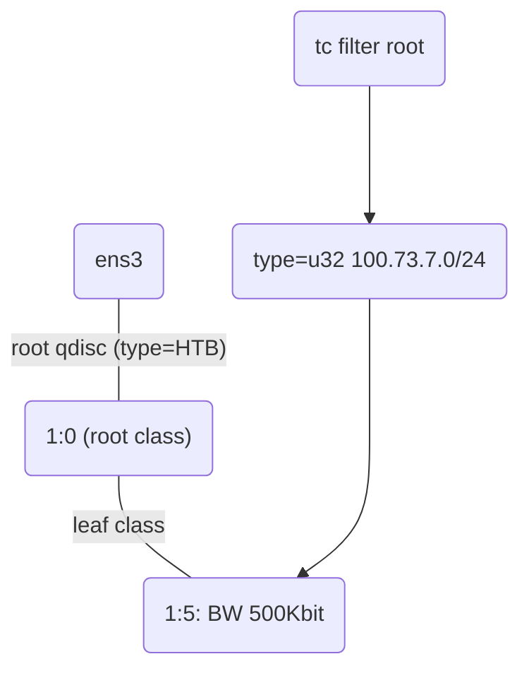
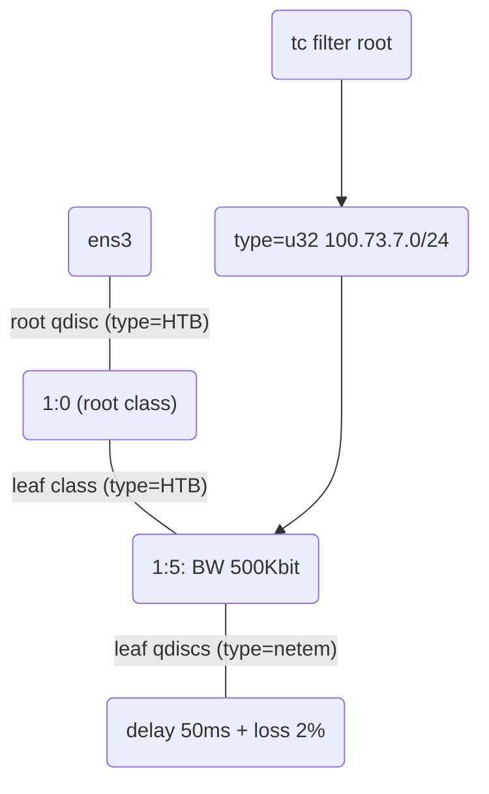

# Network Profile Definition and Validation

The network profile definition is using [NetEm](https://www.linux.org/docs/man8/tc-netem.html) and [iPerf](https://iperf.fr/).

### NetEM

[NetEm](https://www.linux.org/docs/man8/tc-netem.html) (Network Emulator) is an enhancement of the Linux traffic control facilities that allow adding delay, packet loss, duplication and other characteristics to packets outgoing from a selected network interface. NetEm uses the existing Quality Of Service (QOS) and Differentiated Services (diffserv) facilities in the Linux kernel. Manual: [Using NetEm to Emulate Networks - SRT CookBook](https://srtlab.github.io/srt-cookbook/how-to-articles/using-netem-to-emulate-networks.html#:~:text=NetEm%28Network%20Emulator%29%20is%20an%20enhancement%20of%20the%20Linux,Differentiated%20Services%20%28diffserv%29%20facilities%20in%20the%20Linux%20kernel)

#### Examples

- Delay rule

```bash
DelayBase="100ms"
DelayRandom="50ms"
DelayRandomPercent="30%"
sudo tc qdisc add dev $INTF root netem delay $DelayBase $DelayRandom $DelayRandomPercent
```

- Loss rule

```bash
LossPercent="10%"
sudo tc qdisc add dev $INTF root netem loss $LossPercent
```

- Bandwidth limitation rule

```bash
BWCap="500mbit"
sudo tc qdisc add dev $INTF root netem rate $BWCap
```

### iPerf

[iPerf - The TCP, UDP and SCTP network bandwidth measurement tool](https://iperf.fr/) is a tool for active measurements of the maximum achievable bandwidth on IP networks.

iPerf can be run on both Linux and Windows OS, but at least two hosts: one for `Client` and one for `Server`, so please make sure the iPerf server is up before testing.

- iPerf2 Server

```
iperf -s
```

- iPerf3 Server

```
iperf3 -s
```

> note: the iperf version is not compatiable, so make sure both client and server are running on the same version.

#### Examples

```bash
iperf -c $Iperf3SvrIP -t $TestSeconds -i 1 -P $ThreadNum -B $LocalTestIP --logfile ./$logDir/$logFile
```

- Target iPerf2 version server IP `$Iperf3SvrIP`
- Output the testing while total time `$TestSeconds` and print result every `1`s
- Run total `$ThreadNum` threads in parallel
- Specify band local ip `$LocalTestIP` as client
- Save result to log file `./$logDir/$logFile `

## Profile Use Cases

Use a demo lab to demonstrate the profile definition and validation.

### Demo Lab


- VLAN7: 100.73.7.0/24
  - Host1: 100.73.7.11/24
  - Host2: 100.73.7.12/24
- VLAN8: 100.73.8.0/24
  - Host1: 100.73.8.11/24
- Client: 172.16.0.11/24 (Running iPerf2 server)
- WAN-SIM:
  - GRE1: 20.0.0.0/31
  - GRE2: 20.0.0.2/31

#### Initial Validation

##### Ping

```
cisco@HOST1-VLAN7:~$ ping 172.16.0.11 -c 5
PING 172.16.0.11 (172.16.0.11) 56(84) bytes of data.
64 bytes from 172.16.0.11: icmp_seq=1 ttl=61 time=4.29 ms
64 bytes from 172.16.0.11: icmp_seq=2 ttl=61 time=4.27 ms
64 bytes from 172.16.0.11: icmp_seq=3 ttl=61 time=4.21 ms
64 bytes from 172.16.0.11: icmp_seq=4 ttl=61 time=4.15 ms
64 bytes from 172.16.0.11: icmp_seq=5 ttl=61 time=4.24 ms

--- 172.16.0.11 ping statistics ---
5 packets transmitted, 5 received, 0% packet loss, time 4007ms
rtt min/avg/max/mdev = 4.148/4.230/4.292/0.050 ms
```

##### Traceroute

```
cisco@HOST1-VLAN7:~$ traceroute 172.16.0.11
traceroute to 172.16.0.11 (172.16.0.11), 30 hops max, 60 byte packets
 1  100.73.7.2 (100.73.7.2)  2.003 ms  2.138 ms  2.412 ms
 2  20.0.0.2 (20.0.0.2)  9.916 ms  9.940 ms  12.673 ms
 3  10.0.0.9  12.781 ms  12.854 ms  12.860 ms
 4  172.16.0.11 (172.16.0.11)  13.419 ms  16.203 ms  16.238 ms
```

##### iPerf Testing with No Profile Rules

```
cisco@HOST1-VLAN7:~$ iperf -c 172.16.0.11 -t 10 -P 4
------------------------------------------------------------
Client connecting to 172.16.0.11, TCP port 5001
TCP window size: 85.0 KByte (default)
------------------------------------------------------------
[  6] local 100.73.7.11 port 56844 connected with 172.16.0.11 port 5001
[  4] local 100.73.7.11 port 56840 connected with 172.16.0.11 port 5001
[  3] local 100.73.7.11 port 56838 connected with 172.16.0.11 port 5001
[  5] local 100.73.7.11 port 56842 connected with 172.16.0.11 port 5001
[ ID] Interval       Transfer     Bandwidth
[  6]  0.0-10.5 sec  1.50 MBytes  1.20 Mbits/sec
[  5]  0.0-10.5 sec  1.50 MBytes  1.20 Mbits/sec
[  4]  0.0-10.6 sec  1.38 MBytes  1.09 Mbits/sec
[  3]  0.0-10.8 sec  1.50 MBytes  1.17 Mbits/sec
[SUM]  0.0-10.8 sec  5.88 MBytes  4.58 Mbits/sec
```

### Bandwidth Limitation

#### Scenario

- VLAN7: add bandwidth limitation 50Kbit
- VLAN8: no rule

#### Code

##### Rule Script

```
sudo tc qdisc add dev ens3 root handle 1: htb default 10
sudo tc class add dev ens3 parent 1: classid 1:5 htb rate 500Kbit
sudo tc filter add dev ens3 protocol ip parent 1:0 prio 1 u32 match ip src 100.73.7.0/24 flowid 1:5
```

##### Logic Diagram



##### Show Script

```
cisco@wansim:~$ sudo tc -s qdisc show dev ens3
qdisc htb 1: root refcnt 2 r2q 10 default 0x10 direct_packets_stat 2 direct_qlen 1000
 Sent 151 bytes 2 pkt (dropped 0, overlimits 0 requeues 0)
 backlog 0b 0p requeues 0

cisco@wansim:~$ sudo tc -s class show dev ens3
class htb 1:5 root prio 0 rate 500Kbit ceil 500Kbit burst 1600b cburst 1600b
 Sent 0 bytes 0 pkt (dropped 0, overlimits 0 requeues 0)
 backlog 0b 0p requeues 0
 lended: 0 borrowed: 0 giants: 0
 tokens: 400000 ctokens: 400000

cisco@wansim:~$ sudo tc filter show dev ens3
filter parent 1: protocol ip pref 1 u32 chain 0
filter parent 1: protocol ip pref 1 u32 chain 0 fh 800: ht divisor 1
filter parent 1: protocol ip pref 1 u32 chain 0 fh 800::800 order 2048 key ht 800 bkt 0 flowid 1:5 not_in_hw
  match 64490700/ffffff00 at 12
```

#### Test Result

###### VLAN7

VLAN7 host excute a iperf tcp streaming testing to iperf server:

- Run 10 seconds
- Try 4 threads in parallel

```
cisco@HOST1-VLAN7:~$ iperf -c 172.16.0.11 -t 10 -P 4
------------------------------------------------------------
Client connecting to 172.16.0.11, TCP port 5001
TCP window size: 85.0 KByte (default)
------------------------------------------------------------
[  6] local 100.73.7.11 port 56852 connected with 172.16.0.11 port 5001
[  3] local 100.73.7.11 port 56846 connected with 172.16.0.11 port 5001
[  4] local 100.73.7.11 port 56848 connected with 172.16.0.11 port 5001
[  5] local 100.73.7.11 port 56850 connected with 172.16.0.11 port 5001
[ ID] Interval       Transfer     Bandwidth
[  6]  0.0-10.2 sec  99.0 KBytes  79.3 Kbits/sec
[  3]  0.0-10.2 sec  99.0 KBytes  79.3 Kbits/sec
[  4]  0.0-10.2 sec  99.0 KBytes  79.4 Kbits/sec
[  5]  0.0-10.2 sec  99.0 KBytes  79.4 Kbits/sec
[SUM]  0.0-10.2 sec   396 KBytes   317 Kbits/sec
```

Based on the result, it shows the average bandwidth during the total 10s is under 500kbits, which matches bandwidth limitation rule.

###### VLAN8

VLAN8 host excute a iperf tcp streaming testing to iperf server:

- Run 10 seconds
- Try 4 threads in parallel

```
cisco@HOST1-VLAN8:~$ iperf -c 172.16.0.11 -t 10 -P 4
------------------------------------------------------------
Client connecting to 172.16.0.11, TCP port 5001
TCP window size: 85.0 KByte (default)
------------------------------------------------------------
[  5] local 100.73.8.11 port 43456 connected with 172.16.0.11 port 5001
[  6] local 100.73.8.11 port 43458 connected with 172.16.0.11 port 5001
[  4] local 100.73.8.11 port 43454 connected with 172.16.0.11 port 5001
[  3] local 100.73.8.11 port 43452 connected with 172.16.0.11 port 5001
[ ID] Interval       Transfer     Bandwidth
[  5]  0.0-10.3 sec  1.50 MBytes  1.22 Mbits/sec
[  3]  0.0-10.8 sec  1.62 MBytes  1.26 Mbits/sec
[  4]  0.0-10.9 sec  1.62 MBytes  1.25 Mbits/sec
[  6]  0.0-10.9 sec  1.62 MBytes  1.25 Mbits/sec
[SUM]  0.0-10.9 sec  6.38 MBytes  4.89 Mbits/sec
```

Based on the result, it shows the average bandwidth during the total 10s is around 5Mbits, which means no impact for vlan 8 host.

#### Clean Up

Remove customized profile rule on WAN-SIM VM

```
sudo tc qdisc del dev ens3 root
sudo tc qdisc show dev ens3
```

### Combination Rule for Subnets

#### Scenario

- VLAN7: add bandwidth limitation 50Kbit + 50ms latency + 2% package loss
- VLAN8: no rule

#### Code

##### Rule Script

```
sudo tc qdisc add dev ens3 root handle 1: htb default 10
sudo tc class add dev ens3 parent 1: classid 1:5 htb rate 500Kbit
sudo tc qdisc add dev ens3 parent 1:5 handle 10: netem delay 50ms loss 2%
sudo tc filter add dev ens3 protocol ip parent 1:0 prio 1 u32 match ip src 100.73.7.0/24 flowid 1:5
```

##### Logic Diagram



#### Show Script

```
cisco@wansim:~$ sudo tc -s qdisc show dev ens3
qdisc htb 1: root refcnt 2 r2q 10 default 0x10 direct_packets_stat 1 direct_qlen 1000
 Sent 66 bytes 1 pkt (dropped 0, overlimits 0 requeues 0)
 backlog 0b 0p requeues 0
qdisc netem 10: parent 1:5 limit 1000 delay 50.0ms loss 2%
 Sent 0 bytes 0 pkt (dropped 0, overlimits 0 requeues 0)
 backlog 0b 0p requeues 0

cisco@wansim:~$ sudo tc -s class show dev ens3
class htb 1:5 root leaf 10: prio 0 rate 500Kbit ceil 500Kbit burst 1600b cburst 1600b
 Sent 0 bytes 0 pkt (dropped 0, overlimits 0 requeues 0)
 backlog 0b 0p requeues 0
 lended: 0 borrowed: 0 giants: 0
 tokens: 400000 ctokens: 400000

cisco@wansim:~$ sudo tc filter show dev ens3
filter parent 1: protocol ip pref 1 u32 chain 0
filter parent 1: protocol ip pref 1 u32 chain 0 fh 800: ht divisor 1
filter parent 1: protocol ip pref 1 u32 chain 0 fh 800::800 order 2048 key ht 800 bkt 0 flowid 1:5 not_in_hw
  match 64490700/ffffff00 at 12
```

#### Test Result

##### VLAN7

- The `traceroute` and `ping` shows the 50ms delay after WAN-SIM
- The iperf testing has been impacted significantly with bandwidth limitation and package delay

```
cisco@HOST1-VLAN7:~$ traceroute 172.16.0.11
traceroute to 172.16.0.11 (172.16.0.11), 30 hops max, 60 byte packets
 1  100.73.7.2 (100.73.7.2)  1.433 ms  1.578 ms  1.738 ms
 2  20.0.0.2 (20.0.0.2)  7.425 ms  7.445 ms  7.572 ms
 3  10.0.0.9  56.623 ms  57.084 ms  57.265 ms
 4  172.16.0.11 (172.16.0.11)  58.010 ms  60.805 ms  60.898 ms

cisco@HOST1-VLAN7:~$ ping 172.16.0.11 -c 10
PING 172.16.0.11 (172.16.0.11) 56(84) bytes of data.
64 bytes from 172.16.0.11: icmp_seq=1 ttl=61 time=54.3 ms
64 bytes from 172.16.0.11: icmp_seq=2 ttl=61 time=54.4 ms
64 bytes from 172.16.0.11: icmp_seq=3 ttl=61 time=54.3 ms
64 bytes from 172.16.0.11: icmp_seq=4 ttl=61 time=54.4 ms
64 bytes from 172.16.0.11: icmp_seq=5 ttl=61 time=54.5 ms
64 bytes from 172.16.0.11: icmp_seq=6 ttl=61 time=55.0 ms
64 bytes from 172.16.0.11: icmp_seq=7 ttl=61 time=54.5 ms
64 bytes from 172.16.0.11: icmp_seq=9 ttl=61 time=54.8 ms
64 bytes from 172.16.0.11: icmp_seq=10 ttl=61 time=54.2 ms

--- 172.16.0.11 ping statistics ---
10 packets transmitted, 9 received, 10% packet loss, time 9017ms
rtt min/avg/max/mdev = 54.201/54.499/54.998/0.236 ms

cisco@HOST1-VLAN7:~$ iperf -c 172.16.0.11 -t 10 -P 4
------------------------------------------------------------
Client connecting to 172.16.0.11, TCP port 5001
TCP window size: 85.0 KByte (default)
------------------------------------------------------------
[  6] local 100.73.7.11 port 56868 connected with 172.16.0.11 port 5001
[  3] local 100.73.7.11 port 56862 connected with 172.16.0.11 port 5001
[  4] local 100.73.7.11 port 56864 connected with 172.16.0.11 port 5001
[  5] local 100.73.7.11 port 56866 connected with 172.16.0.11 port 5001
[ ID] Interval       Transfer     Bandwidth
[  6]  0.0-10.2 sec  99.0 KBytes  79.6 Kbits/sec
[  3]  0.0-10.2 sec  99.0 KBytes  79.6 Kbits/sec
[  4]  0.0-10.2 sec   102 KBytes  81.8 Kbits/sec
[  5]  0.0-10.2 sec  99.0 KBytes  79.5 Kbits/sec
[SUM]  0.0-10.2 sec   399 KBytes   320 Kbits/sec
```

##### VLAN8

- 'traceroute' and 'ping' time is same as initial
- iperf testing is same as initial.

```
cisco@HOST1-VLAN8:~$ traceroute 172.16.0.11
traceroute to 172.16.0.11 (172.16.0.11), 30 hops max, 60 byte packets
 1  100.73.8.2 (100.73.8.2)  1.692 ms  1.759 ms  2.562 ms
 2  20.0.0.0 (20.0.0.0)  6.373 ms  6.467 ms  6.566 ms
 3  10.0.0.9  8.171 ms  8.454 ms  8.684 ms
 4  172.16.0.11 (172.16.0.11)  9.546 ms  9.631 ms  9.647 ms

cisco@HOST1-VLAN8:~$ ping 172.16.0.11 -c 10
PING 172.16.0.11 (172.16.0.11) 56(84) bytes of data.
64 bytes from 172.16.0.11: icmp_seq=1 ttl=61 time=3.90 ms
64 bytes from 172.16.0.11: icmp_seq=2 ttl=61 time=3.90 ms
64 bytes from 172.16.0.11: icmp_seq=3 ttl=61 time=3.47 ms
64 bytes from 172.16.0.11: icmp_seq=4 ttl=61 time=3.48 ms
64 bytes from 172.16.0.11: icmp_seq=5 ttl=61 time=3.53 ms
64 bytes from 172.16.0.11: icmp_seq=6 ttl=61 time=3.71 ms
64 bytes from 172.16.0.11: icmp_seq=7 ttl=61 time=3.79 ms
64 bytes from 172.16.0.11: icmp_seq=8 ttl=61 time=3.46 ms
64 bytes from 172.16.0.11: icmp_seq=9 ttl=61 time=4.06 ms
64 bytes from 172.16.0.11: icmp_seq=10 ttl=61 time=3.53 ms

--- 172.16.0.11 ping statistics ---
10 packets transmitted, 10 received, 0% packet loss, time 9011ms
rtt min/avg/max/mdev = 3.457/3.682/4.059/0.207 ms

cisco@HOST1-VLAN8:~$ iperf -c 172.16.0.11 -t 10 -P 4
------------------------------------------------------------
Client connecting to 172.16.0.11, TCP port 5001
TCP window size: 85.0 KByte (default)
------------------------------------------------------------
[  6] local 100.73.8.11 port 43466 connected with 172.16.0.11 port 5001
[  3] local 100.73.8.11 port 43460 connected with 172.16.0.11 port 5001
[  5] local 100.73.8.11 port 43464 connected with 172.16.0.11 port 5001
[  4] local 100.73.8.11 port 43462 connected with 172.16.0.11 port 5001
[ ID] Interval       Transfer     Bandwidth
[  6]  0.0-10.0 sec  1.50 MBytes  1.26 Mbits/sec
[  3]  0.0-10.4 sec  1.38 MBytes  1.11 Mbits/sec
[  4]  0.0-10.6 sec  1.38 MBytes  1.08 Mbits/sec
[  5]  0.0-10.7 sec  1.50 MBytes  1.17 Mbits/sec
[SUM]  0.0-10.7 sec  5.75 MBytes  4.50 Mbits/sec
```

#### Clean Up

On WAN-SIM VM:

```
sudo tc qdisc del dev ens3 root
sudo tc qdisc show dev ens3
```

# Q&A

#### If network rules already configured, how to update the rules?

`netem` has `change` command to meet this requirement. Example:

- Existing Rules

```bash
sudo tc qdisc add dev gre1 root handle 1a1a: htb default 1
sudo tc class add dev gre1 parent 1a1a: classid 1a1a:1 htb rate 25Mbit
sudo tc class add dev gre1 parent 1a1a: classid 1a1a:10 htb rate 25Mbit
sudo tc qdisc add dev gre1 parent 1a1a:10 handle 10 netem delay 60ms
sudo tc filter add dev gre1 protocol ip parent 1a1a: prio 1 u32 match ip dst 100.68.180.0/24 flowid 1a1a:10
sudo tc filter add dev gre1 protocol ip parent 1a1a: prio 1 u32 match ip dst 100.68.181.0/24 flowid 1a1a:10
```

- Update Rules

```bash
sudo tc class change dev gre1 parent 1a1a: classid 1a1a:10 htb rate 10Mbit
sudo tc qdisc change dev gre1 parent 1a1a:10 handle 10 netem loss 1%
```

- Validate Rules

```bash
# sudo tc qdisc show dev gre1
qdisc htb 1a1a: root refcnt 2 r2q 10 default 0x1 directpacketsstat 0 direct_qlen 1000
qdisc netem 10: parent 1a1a:10 limit 1000 loss 1%
# sudo tc -s class show dev gre1
class htb 1a1a:10 root leaf 10: prio 0 rate 10Mbit ceil 10Mbit burst 1600b cburst 1600b
Sent 0 bytes 0 pkt (dropped 0, overlimits 0 requeues 0)
backlog 0b 0p requeues 0
lended: 0 borrowed: 0 giants: 0
tokens: 8000 ctokens: 8000
class htb 1a1a:1 root prio 0 rate 25Mbit ceil 25Mbit burst 1600b cburst 1600b
Sent 840 bytes 14 pkt (dropped 0, overlimits 0 requeues 0)
backlog 0b 0p requeues 0
lended: 14 borrowed: 0 giants: 0
tokens: 7700 ctokens: 7700
# sudo tc -s filter show dev gre1
filter parent 1a1a: protocol ip pref 1 u32 chain 0
filter parent 1a1a: protocol ip pref 1 u32 chain 0 fh 800: ht divisor 1
filter parent 1a1a: protocol ip pref 1 u32 chain 0 fh 800::800 order 2048 key ht 800 bkt 0 flowid 1a1a:10 notinhw
match 6444b400/ffffff00 at 16
filter parent 1a1a: protocol ip pref 1 u32 chain 0 fh 800::801 order 2049 key ht 800 bkt 0 flowid 1a1a:10 notinhw
match 6444b500/ffffff00 at 16
```
