# Streaming Telemetry from the WAN-SIM using Telegraf, InfluxDB, and Girfana (TIG)

In our lab we have set this up on an Ubuntu VM running Docker. The InfluxDB container can be resource intensive. The more vCPU's and memory you can provide the better. I like to start at 8 vCPU's and 16GB of memory. 

## Install Docker 

```bash
# Jammy docker install commands
sudo apt update -y
sudo apt install apt-transport-https ca-certificates curl software-properties-common -y
curl -fsSL https://download.docker.com/linux/ubuntu/gpg | sudo gpg --dearmor -o /usr/share/keyrings/docker-archive-keyring.gpg 
echo "deb [arch=$(dpkg --print-architecture) signed-by=/usr/share/keyrings/docker-archive-keyring.gpg] https://download.docker.com/linux/ubuntu $(lsb_release -cs) stable" | sudo tee /etc/apt/sources.list.d/docker.list > /dev/null
sudo apt update -y
apt-cache policy docker-ce
sudo apt install docker-ce -y
sudo systemctl status docker
```

- SCP docker compose files to the Linux VM. Be sure to use your own IP address.

```bash
scp .\Telemetry\InfluxGrafana_Only\docker-compose.yml wansimadmin@10.10.37.5:~/
```

- Log Into the Ubuntu VM and start the containers

```bash
# if not already in the home directory, go there now.
cd ~/
sudo docker compose up &
# validate containers started up.
sudo docker ps 
```

## Configure InfluxDB

- Open a browser and navigate to the IP address of your Linux VM. Continue through the setup wizzard
http://'IP ADDRESS':8086

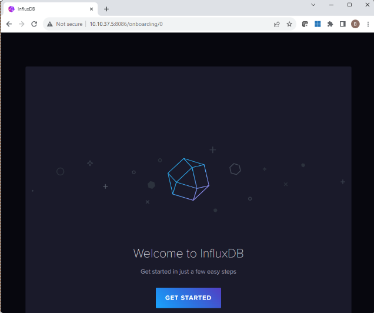

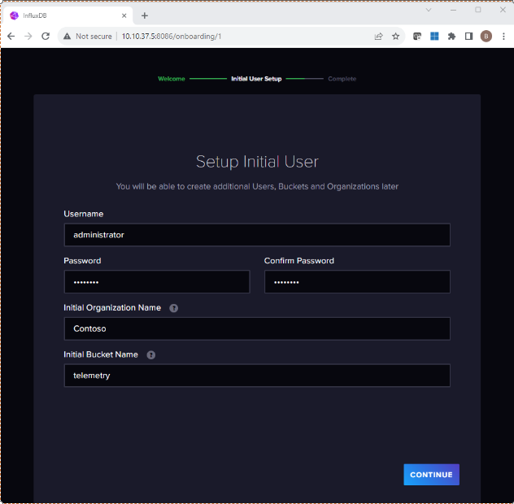

- Make sure you copy this API token and save it somewhere safe.


- Then select configure later

- Create a new API token that can be used by our Telegraf agents and Grafana to connect to InfluxDB. Go to the "API Tokens" section and Generate an All Access API Token, or Custom but you will need to make sure the Custom token is setup correctly.

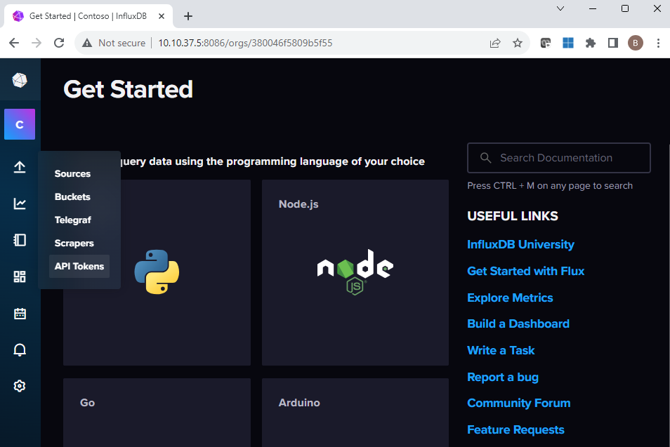


## Install and Configure Telegraf and SFLOW(HSFLOWD) on your WAN-SIM VM

- Update the Telegraf.conf file

*In this section be sure to put the IP Address of your Ubuntu VM that's hosting the InfluxDB*


- Edit the telegraf.service unit file to include your API key that you generated previously while setting up InfluxDB

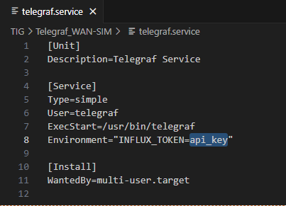

- scp telegraf.conf, telegraf.service and hsflowd.conf file to the WAN-SIM
  
```bash
scp -r ..\Telemetry\Telegraf_WAN-SIM wansimadmin@10.10.37.5:~/
```

- SSH to your WAN-SIM

```bash
# Install Telegraf
sudo apt install telegraf -y

# Download hsflowd
curl https://github.com/sflow/host-sflow/releases/download/v2.0.53-1/hsflowd-ubuntu22_2.0.53-1_amd64.deb -o ~/hsflowd.deb

# Install hsflowd
sudo dpkg -i ~/hsflowd.deb
# enable hsflowd
sudo systemctl enable hsflowd

# copy telegraf.conf to /etc/telegraf
sudo cp Telegraf_WAN-SIM/telegraf.conf /etc/telegraf/telegraf.conf

# copy hwflowd.conf to /etc/hsflowd.conf
sudo cp Telegraf_WAN-SIM/hsflowd.conf /etc/hsflowd.conf

# copy the telegraf.service file to /etc/systemd/system/telegraf.service
sudo cp Telegraf_WAN-SIM/telegraf.service /etc/systemd/system/telegraf.service
sudo systemctl daemon-reload
sudo systemctl start telegraf
```

## Configure Grafana http://'IP Address':3000

*Default credentials are admin/admin and must be changed the first time you login.*

- Setup a Connection to InfluxDB
  
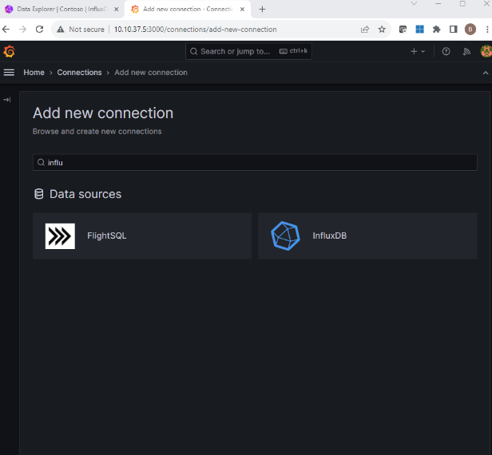

- Select FluxQL for the query language

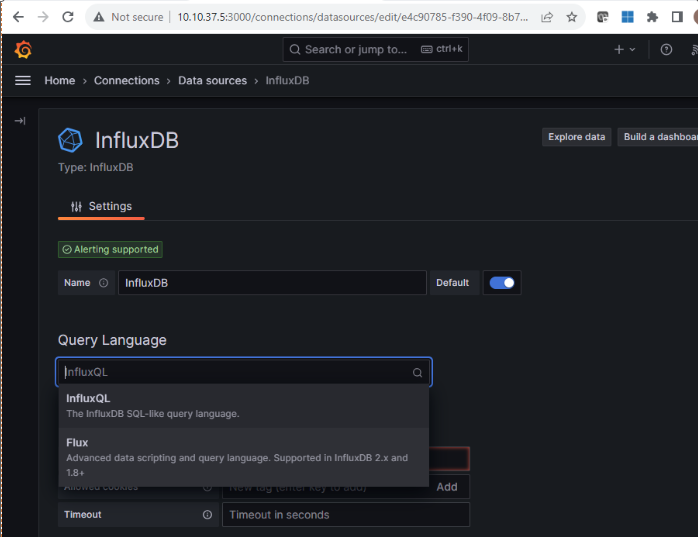

- Be sure to enter the API token we generated earlier in InfuxDB.
  
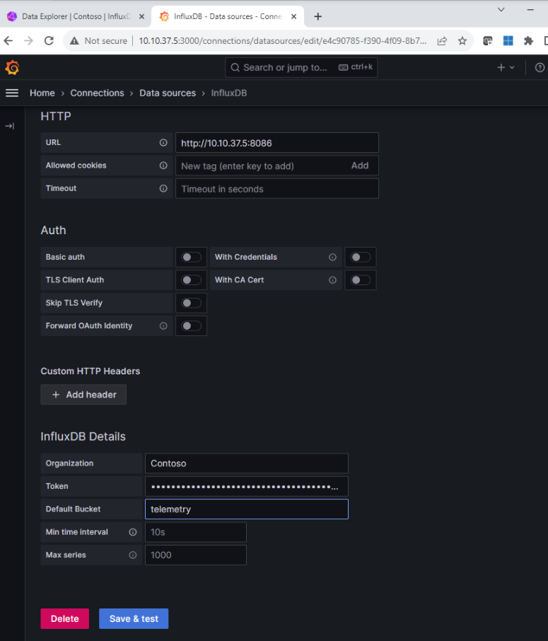

- Once all the info is entered, "Save & Test". Upon successful test you will this. There are two important items to make note of.

1. You should see "data source is working"
1. In the browsers URI we need to save the highlighted section. This is the UID used to connect to Influx and is importing for the next step.

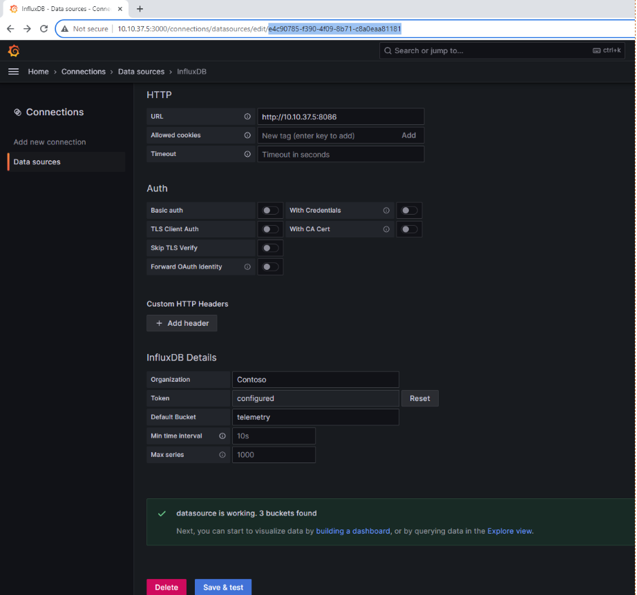

- Go to Dashboards and then New>Import
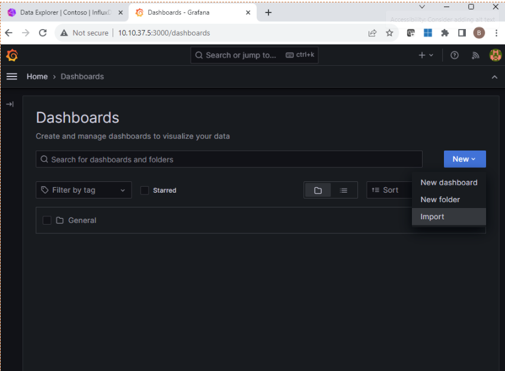

*When Importing a JSON we need to set the correct UID for it work and provide a "Name" that is relevant to the environment.*

*I have not had success using click "Change uid" to update all the guids in the dashboard. Its best to open the json file and do a search and replace.*

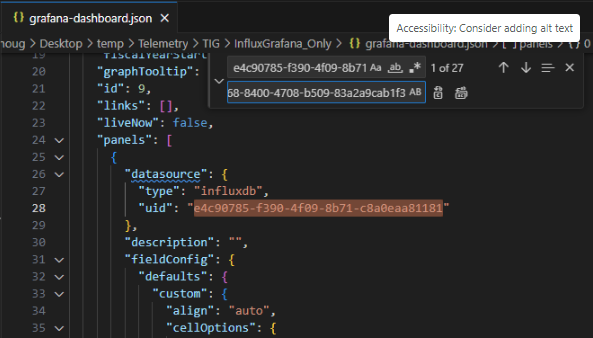

- Name your dashboard

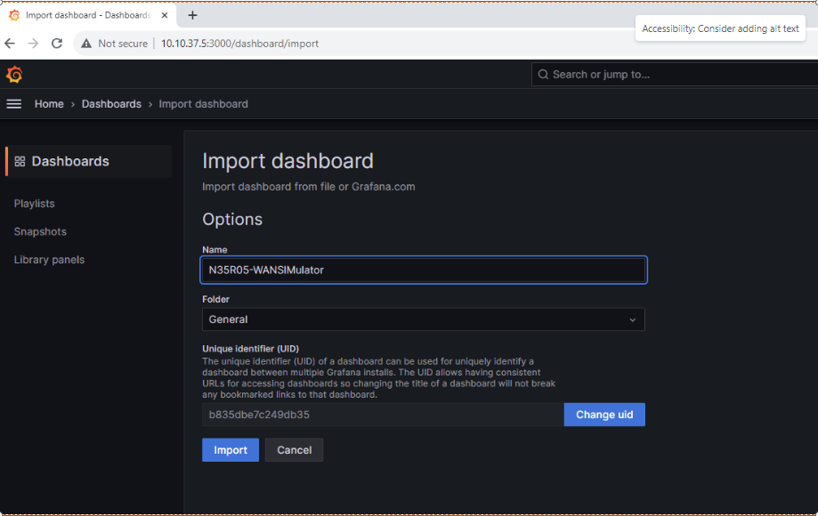
