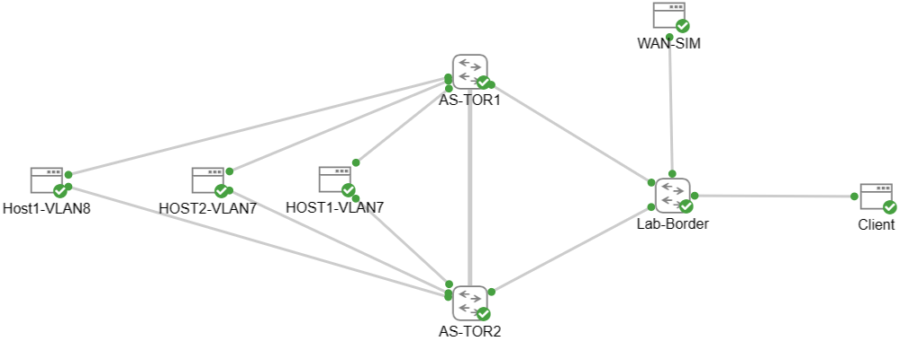

# WAN-SIM VM Setup



## Initial Bootup
Install essential packages and set hostname.

```bash
sudo apt-get update
sudo apt-get install -y net-tools frr iperf iperf3 traceroute lldpd
HOSTNAME="WAN-SIM"
sudo hostnamectl set-hostname $HOSTNAME
```

## Network Setup
Config WAN-SIM VM network interfaces, here is an example for netplan yaml file: [Here](../config/30_netplan_wansim.yaml)

#### Loopback Interface
- Add ip under defaul lo as GRE tunnel Source IP
- This ip will be advertised for GRE tunnel establish

#### Physical Interface
- This ip only use for establishing BGP peer with uplink router to advertise more granular routes

#### GRE Tunnel Interface
- GRE tunnel ips are private ip and can be reused
- Source IP is loopback ip
- Destination IP would be rack BMC IP. (Destination IP has to be VLAN IP not VIP, otherwise the GRE Tunnel only establish with active switch)

```bash
# Config Interface
sudo cp ./30_netplan_wansim.yaml /etc/netplan/30_netplan_wansim.yaml
sudo netplan apply
```

## FRR Config
### BGP Peer with Uplink
### BGP Peer with TOR Switches

## Post-Validation
### Show Command
### Ping
### Traceroute

## Q&A
### Does WAN-SIM VM has to be stay in the same data center of Azure Stack Cluster?
In therory, no, because unless the GRE tunnels  and BGP can be established, the WAN-SIM solution can be applied. However, to have better network profile rule control, it would be good to install in the same location with Azure Stack Cluster.